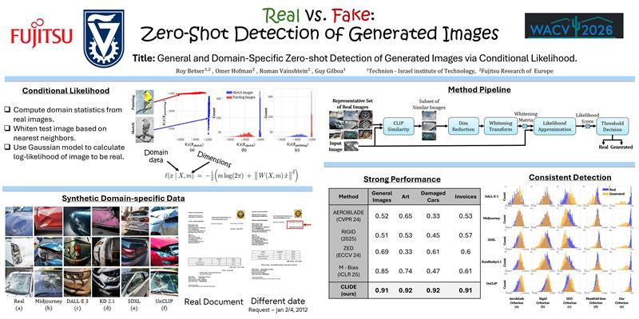

# 🔍 General and Domain-Specific Zero-shot Detection of Generated Images via Conditional Likelihood

📄 [Paper](https://arxiv.org/abs/2512.05590) (WACV 2026) • 🗂️ [Dataset](https://huggingface.co/datasets/Fujitsu-FRE/clide_synthetic_datasets) • 🌐 [Webpage](https://rbetser.github.io/CLIDE/) • 🎥 Video (coming soon)


This repository contains the official implementation of CLIDE, a zero-shot detection method for identifying AI-generated images using a **conditional likelihood approximation** over CLIP embeddings.
The method applies a whitening transform to CLIP image embeddings and uses the resulting (approximate) Gaussian likelihood as a detection score — **without training on generated images**.

---

## 🛠️ Installation

### 📦 Requirements

* Python 3.8+
* CUDA-compatible GPU (recommended)
* PyTorch
* OpenAI CLIP
* NumPy
* Pillow (PIL)
* tqdm
* scikit-learn

Install all dependencies via:

```bash
pip install -r requirements.txt
```

---

## 🚀 Usage

The main entry point is:

```bash
python detection.py
```

All paths have sensible defaults, but for real experiments you will typically override at least `--image_path`, `--labels_path`, and `--rep_dir_path`.

### Command-line Arguments

* `--image_path`
  Path to the **directory** containing images to evaluate.

* `--rep_dir_path`
  Path to the **directory** of representative set of images used to build the whitening statistics.

* `--labels_path`
  Path to a `.pt` file containing a tuple `(labels, threshold)`, saved with `torch.save`.

  * `labels`: 1D tensor / list of 0/1 labels (same order as images in `image_path`)
  * `threshold`: scalar threshold on the likelihood score for binary classification.

* `--w_mat_path`
  Path to a precomputed whitening matrix and mean vector.
  If the file does **not** exist and `--use_global` is set, it will be computed from `--rep_dir_path` and saved here.

* `--rep_mat_path`
  Path to a precomputed representative set embedding matrix.
  If the file does **not** exist and `--use_global` is **not** set, it will be computed from `--rep_dir_path`.

* `--likelihood_path`
  Path to save the computed likelihood values as a PyTorch tensor.

* `--metrics_path`
  Path to save the evaluation metrics dictionary.

* `--use_global`
  If set, use a **global** whitening matrix (computed once from `rep_dir_path`) for all images.
  If not set, the method performs **local whitening** using the top-`k` representative neighbors per test image.

* `--k` (default: `500`)
  Number of representative samples used for local whitening (only used when `--use_global` is **not** set).

* `--m` (default: `400`)
  Number of PCA dimensions used in the whitening transform.

---

## 💻 Example Commands

### 1. Global whitening (single whitening matrix for all images)

```bash
python detection.py \
  --image_path data/eval_images \
  --labels_path labels.pt \
  --w_mat_path whitening_matrix_general.pt \
  --likelihood_path likelihoods_general.pt \
  --metrics_path metrics_general.pt \
  --use_global
```

### 2. Local whitening (per-image local neighborhood)

```bash
python detection.py \
  --image_path data/eval_images \
  --labels_path labels.pt \
  --rep_mat_path rep_matrix_general.pt \
  --likelihood_path likelihoods_local.pt \
  --metrics_path metrics_local.pt \
  --k 500 \
  --m 400
```

### 3. Format of `labels.pt`

The `labels_path` file should contain a tuple `(labels, threshold)`:

```python
import torch

labels = torch.tensor([...], dtype=torch.long)  # 0/1 labels, length = #images
threshold = 0.0  # example threshold on likelihood

torch.save((labels, threshold), "labels.pt")
```

---

## 📊 Output

* **Likelihood values**
  Saved as a 1D PyTorch tensor at `--likelihood_path`.

* **Performance metrics**
  A dictionary with:

  * AUC
  * Average Precision (AP)
  * F1-score
  * Accuracy

  saved to `--metrics_path` (via `torch.save`).

---

## 🧮 Precomputed Matrices

The repository includes several precomputed statistics files:

* `rep_matrix_general.pt`
  Representative set embeddings for the **general image** domain.

* `rep_matrix_cars.pt`
  Representative set embeddings for the **damaged cars** image domain.

* `whitening_matrix_general.pt`
  Whitening matrix and mean vector `(w_mat, w_mean)` for the general image domain (for `--use_global`).

* `whitening_matrix_cars.pt`
  Whitening matrix and mean vector `(w_mat, w_mean)` for the damaged cars domain (for `--use_global`).

You can point `--rep_mat_path` or `--w_mat_path` directly to these files to reuse them.

---

## 📚 Citation

```bibtex
@inproceedings{betser2026clide,
  title     = {General and Domain-Specific Zero-shot Detection of Generated Images via Conditional Likelihood},
  author    = {Betser, Roy and Hofman, Omer and Vainshtein, Roman and Gilboa, Guy},
  booktitle = {Proceedings of the IEEE/CVF Winter Conference on Applications of Computer Vision (WACV)},
  year      = {2026},
  eprint    = {2512.05590},
  archivePrefix = {arXiv},
}
```

---

## 📄 License


This repository is released under the **CC BY-NC 4.0 license**.  
You may use the code for research and academic purposes only.  
Commercial use is strictly prohibited. Patent rights are fully reserved.

Copyright © 2025  
**Fujitsu Research of Europe (FRE)**  
All rights reserved.


